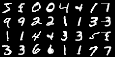
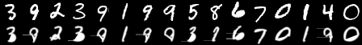

# diffvg-triton

A fast, pure-Python reimplementation of [diffvg](https://github.com/BachiLi/diffvg) using Triton kernels. Achieves numerical parity with the original C++/CUDA implementation while being significantly simpler and faster for batched workloads.

## Key Features

- **Pure Python/Triton** - No C++ compilation, no custom CUDA kernels
- **Batched rendering** - Efficient parallel rendering of multiple scenes
- **Full gradient support** - Backpropagation through the rendering pipeline
- **Numerical parity** - Matches diffvg output for forward and backward passes

## Performance

Backward pass speedup vs pydiffvg (28x28 canvas, 1 path, 3 segments):

| Batch Size | Backward Pass | Speedup |
|------------|---------------|---------|
| 8 | 5.2ms vs 16.2ms | **3.1x** |
| 32 | 11.6ms vs 71.7ms | **6.2x** |
| 64 | 23.1ms vs 137.9ms | **6.0x** |

*Benchmarked on NVIDIA DGX Spark. (tests/benchmarking)*

## Demo: MNIST VAE

Vector graphics reconstruction using 1 bezier path with 3 segments per digit:



*Left: reference MNIST digit, Right: vector graphics reconstruction*

## Installation

```bash
pip install torch triton numpy
pip install -e .
```

## Quick Start

```python
from diffvg_triton.render_batch import render_batch_fast

# Render batched bezier paths
# control_points: [B, num_paths, num_segments, 4, 2]
# widths: [B, num_paths]
# alphas: [B, num_paths]
output = render_batch_fast(
    canvas_width=28,
    canvas_height=28,
    control_points=control_points,
    widths=widths,
    alphas=alphas,
    num_samples=4,
    use_fill=True,
)
# output: [B, 1, H, W] with gradients
```

## MNIST VAE Example

Train a VAE that generates MNIST digits as vector graphics:

```bash
python examples/mnist_vae.py train --paths 1 --segments 3 --num_epochs 50
```

## MNIST VQ-VAE Example

Train a VQ-VAE that learns discrete codebook representations of MNIST digits as vector graphics:

```bash
python examples/vqvae_train.py --num_epochs 30 --bs 64 --latent_dim 20 \
    --num_embeddings 64 --paths 1 --segments 3 --use_ema --output_dir outputs
```



*Top row: original MNIST digits, Bottom row: VQ-VAE reconstructions (epoch 15)*

## Citation

If you use this code, please cite:

```bibtex
@software{diffvg_triton,
    title={diffvg-triton: Fast Differentiable Vector Graphics in Pure Python},
    author={Carter McClellan},
    year={2025},
    url={https://github.com/CarterMcClellan/diffvg-triton}
}
```

This work builds upon the original diffvg:

```bibtex
@article{li2020differentiable,
    title={Differentiable Vector Graphics Rasterization for Editing and Learning},
    author={Li, Tzu-Mao and Luk{\'a}{\v{c}}, Michal and Gharbi, Micha{\"e}l and Ragan-Kelley, Jonathan},
    journal={ACM Trans. Graph. (Proc. SIGGRAPH Asia)},
    year={2020}
}
```

## License

MIT
